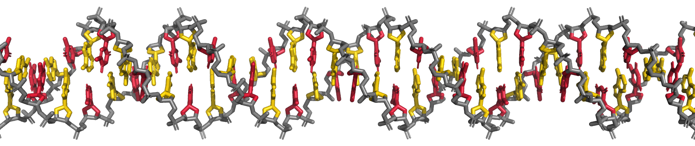

# Welcome to the 'Genome Computing' Repository
## University of Maryland, First-Year Innovation & Research Experiences Program (https://fire.umd.edu/gc)

This will be the repository for notebooks, code, and data for the University of Maryland FIRE "Genome Computing" Stream.

Researchers of the GC stream will be interacting with Python3 through Anaconda under a 'dnalab' environment. This environment includes:
- numpy 1.23
- scipy 1.9
- matplotlib 3.6
- pandas 1.5
- seaborn 0.12
- scikit-learn 1.1
- jupyter 1
- biopython 1

Current directories include Jupyter Notebooks for Python3 training with DNA model files.

Dr. Robert Young, 2023
